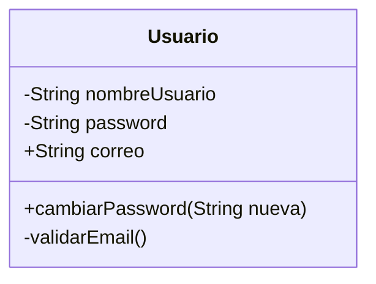
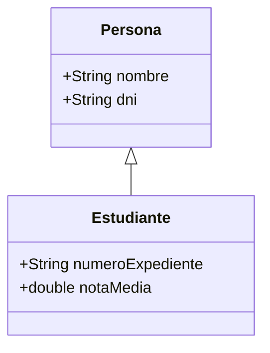
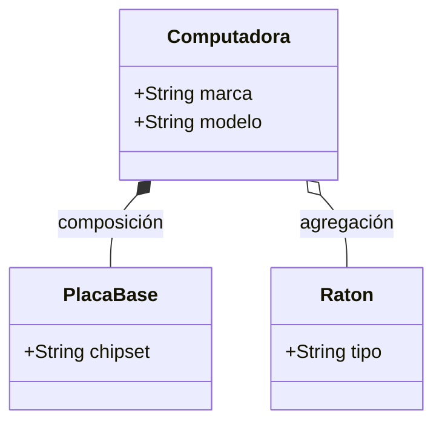
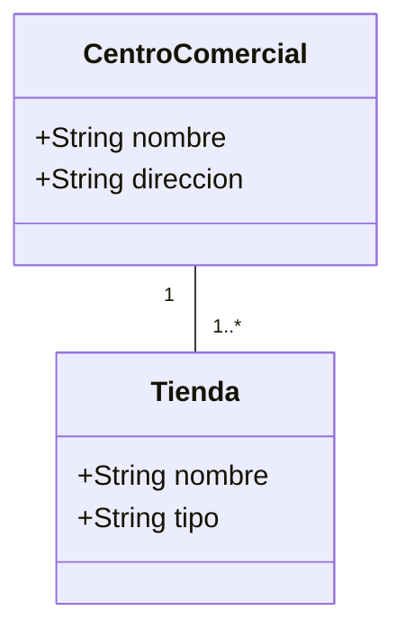

# Bateria_de_ejercicios

Ejercicio 1.

```mermaid

classDiagram
    class Usuario {
        -String nombreUsuario
        -String password
        +String correo
        
        +cambiarPassword(String nueva)
        -validarEmail()
    }

```

Ejercicio 2.

```mermaid

classDiagram
    class Persona {
        +String nombre
        +String dni
    }

    class Estudiante {
        +String numeroExpediente
        +double notaMedia
    }

    Persona <|-- Estudiante

```

Ejercicio 3.

```mermaid

classDiagram
    class Computadora {
        +String marca
        +String modelo
    }

    class PlacaBase {
        +String chipset
    }

    class Raton {
        +String tipo
    }

    Computadora *-- PlacaBase : composición
    Computadora o-- Raton : agregación

```

Ejercicio 4

```mermaid


classDiagram
    class CentroComercial {
        +String nombre
        +String direccion
    }

    class Tienda {
        +String nombre
        +String tipo
    }

    CentroComercial "1" -- "1..*" Tienda

```

