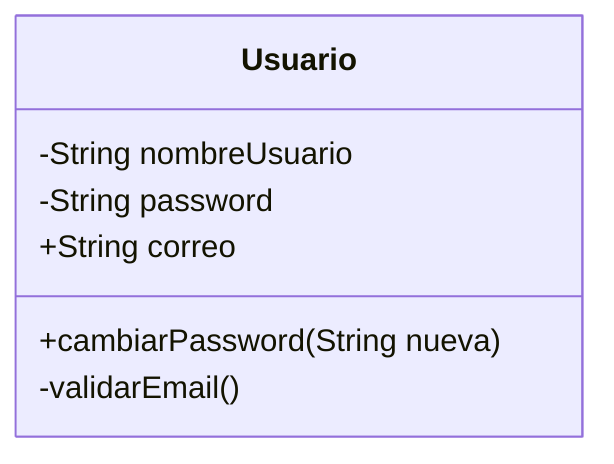
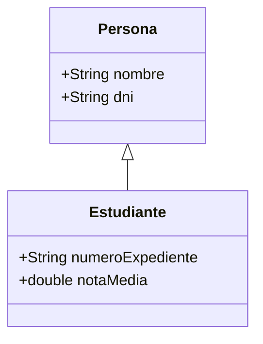

# Bateria_de_ejercicios

Ejercicio 1.

```mermaid

classDiagram
    class Usuario {
        -String nombreUsuario
        -String password
        +String correo
        
        +cambiarPassword(String nueva)
        -validarEmail()
    }

```

Ejercicio 2.

```mermaid

classDiagram
    class Persona {
        +String nombre
        +String dni
    }

    class Estudiante {
        +String numeroExpediente
        +double notaMedia
    }

    Persona <|-- Estudiante

```

