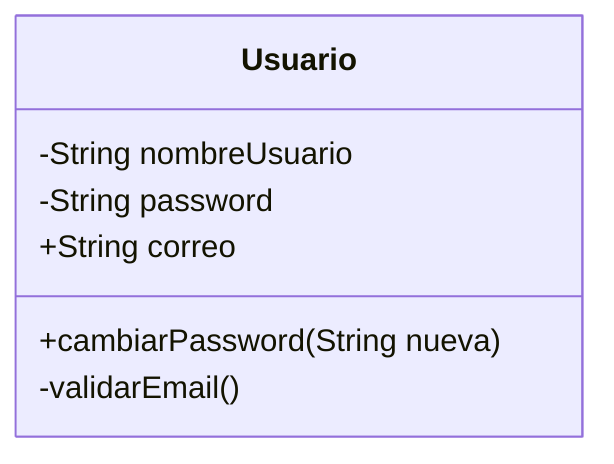

# Bateria_de_ejercicios

Ejercicio 1.

```mermaid

classDiagram
    class Usuario {
        -String nombreUsuario
        -String password
        +String correo
        
        +cambiarPassword(String nueva)
        -validarEmail()
    }

```
