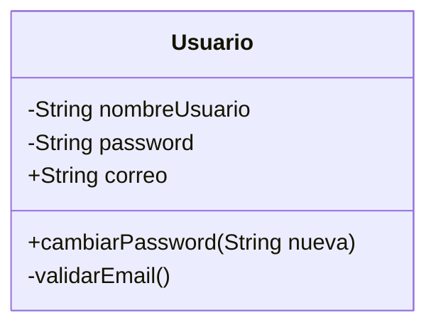
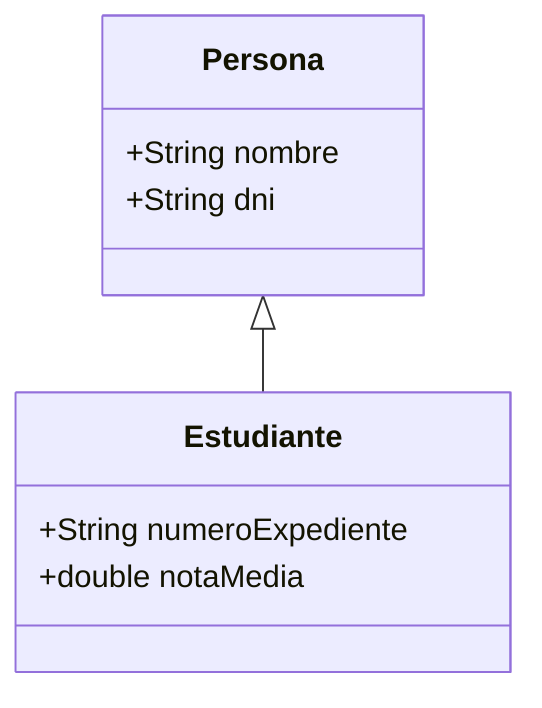
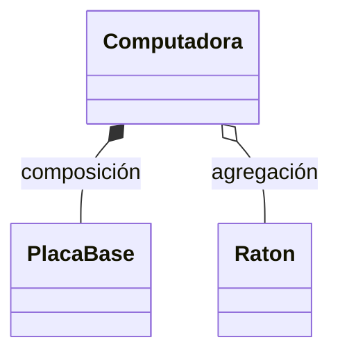
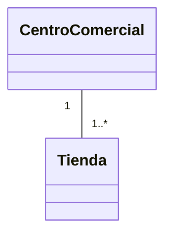
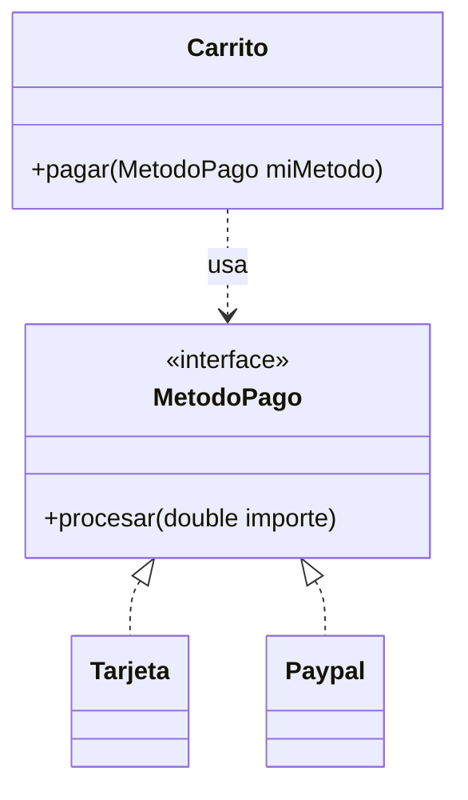
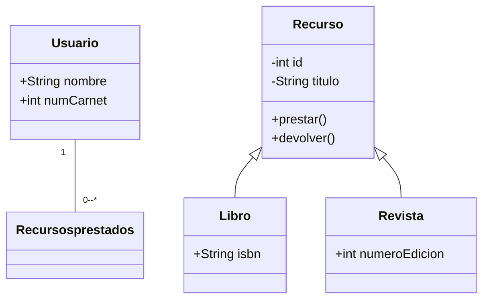

# Bateria_de_ejercicios

Ejercicio 1.

```mermaid

classDiagram
    class Usuario {
        -String nombreUsuario
        -String password
        +String correo
        
        +cambiarPassword(String nueva)
        -validarEmail()
    }

```

Ejercicio 2.

```mermaid

classDiagram
    class Persona {
        +String nombre
        +String dni
    }

    class Estudiante {
        +String numeroExpediente
        +double notaMedia
    }

    Persona <|-- Estudiante

```

Ejercicio 3.

```mermaid

classDiagram
    class Computadora {
       
    }

    class PlacaBase {
   
    }

    class Raton {
    
    }

    Computadora *-- PlacaBase : composición
    Computadora o-- Raton : agregación

```

Ejercicio 4

```mermaid


classDiagram
    class CentroComercial {
       
    }

    class Tienda {
        
    }

    CentroComercial "1" -- "1..*" Tienda

```
Ejercicio 5

```mermaid

classDiagram
    class MetodoPago {
        <<interface>>
        +procesar(double importe)
    }

    class Tarjeta {
        
    }

    class Paypal {
        
    }

    class Carrito {
        +pagar(MetodoPago miMetodo)
    }

    MetodoPago <|.. Tarjeta
    MetodoPago <|.. Paypal
    Carrito ..> MetodoPago : usa

```

Ejercicio 6

```mermaid

classDiagram
    
    class Usuario {
    +String nombre
    +int numCarnet
    }

    class Recurso {
    -int id
    -String titulo
    +prestar()
    +devolver()
    }

    class Libro {
    +String isbn
    }

    class Revista {
    +int numeroEdicion
    }

    Recurso <|-- Libro
    Recurso <|-- Revista
    Usuario "1" -- "0--*" Recursos prestados
 

```
